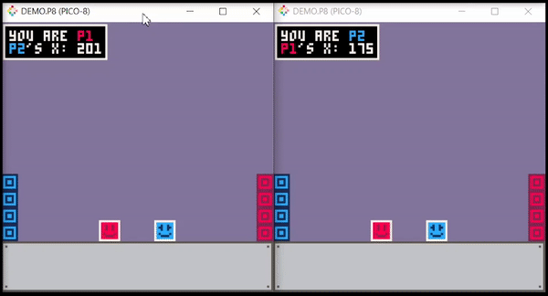

# Pico-8 LAN Multiplayer

## Synopsis:
LAN multiplayer for Pico-8! Please let me know if you make any games with this tool!  
I will simplify the demo.p8 file soon and make it not drop button presses...

## Requirements:
* [Python 3.7+](https://www.python.org/)
* [Optional Colorama Library](https://pypi.org/project/colorama/) - *pip install colorama*

## Usage:
* Put demo.p8 into your Pico-8 cart folder
* Put the Pico-8 application location into settings.txt
* Put the Pico-8 cart folder location into settings.txt
* If you are *Player 1*, in your terminal: *python server.py (python3 on Mac and Linux)*
* If you are *Player 2*, in your terminal: *python client.py (python3 on Mac and Linux)*
* If you are testing both on a single machine: *python testing.py (python3 on Mac and Linux)*

## Example:

## Support:
* Windows :heavy_check_mark:
* Linux: :question:
* Mac: :question:

  *(Testing on Linux and Mac later...)*
